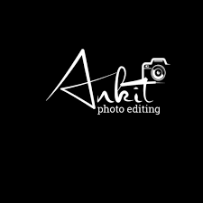

<!DOCTYPE html>
<html lang="en">
<head>
  <meta charset="UTF-8">
  <meta name="viewport" content="width=device-width, initial-scale=1.0">
  <title>Photography Studio</title>
  <link rel="stylesheet" href="aj.css">
  <link href="https://fonts.googleapis.com/css2?family=Roboto:wght@400;500;700&display=swap" rel="stylesheet">
</head>
<body>
  
  <header>
    

    <nav class="nav">
      <ul>
        <li><a href="#services">Services</a></li>
        <li><a href="#portfolio">Portfolio</a></li>
        <li><a href="#contact">Contact</a></li>
      </ul>
    </nav>
  </header>

  <section class="hero">
    <h1>Frame the Moment   Capture the Story</h1>
    
Transform ordinary into extraordinary. Let us create stunning memories for you.

    <button class="btn">Book Now</button>
  </section>

  <section id="services" class="services">
    <h2>What We Offer</h2>
    
Professional photography and videography services for all occasions.

    

      

        <h3>Photography</h3>
        
Stunning photography to capture your precious moments.

      

      

        <h3>Videography</h3>
        
Immersive videos that tell your story with elegance.

      

      

        <h3>Custom Shoots</h3>
        
Tailored photo and video shoots designed just for you.

      

    

    

      

        <h3>1000+</h3>
        
Projects Completed

      

      

        <h3>4.9/5</h3>
        
Customer Rating

      

      

        <h3>50+</h3>
        
Team Members

      

    

  </section>

  <section id="portfolio" class="portfolio">
    <h2>Featured Work</h2>
    

      
      
      
      
    

    <button class="btn">View More</button>
  </section>

  <section class="instagram">
    <h2>@yourstudiohandle</h2>
    
Follow us on Instagram for our latest creations and behind-the-scenes moments.

    

      
      
      
      
    

  </section>

  <section id="contact" class="cta">
    <h2>Ready to Start Your Journey?</h2>
    
Let’s create something extraordinary together. Book your session today!

    <button class="btn">Contact Us</button>
  </section>

  <footer>
    
&copy; 2025 ankit's studio. All Rights Reserved.

    <ul>
      <li><a href="#">Privacy Policy</a></li>
      <li><a href="#">Terms of Service</a></li>
    </ul>
  </footer>
</body>
</html>
body {
    font-family: 'Roboto', sans-serif;
    margin: 0;
    padding: 0;
    line-height: 1.6;
    color:rgb(61, 61, 61);
    background-color: white;
}

header {
    display: flex;
    justify-content: space-between;
    align-items: center;
    padding: 1rem 2rem;
    background: rgb(51, 52, 52);
    color: white;
    position: sticky;
    top: 0;
    z-index: 1000;
}

header .nav ul {
    display: flex;
    list-style: none;
    gap: 1.5rem;
}

header .nav ul li a {
    color: white;
    text-decoration: none;
    font-weight: 500;
    transition: color 0.3s ease;
}

header .nav ul li a:hover {
    color: rgb(245, 96, 96);
}

.hero {
    text-align: center;
    padding: 5rem 2rem;
    background: linear-gradient(to bottom right, rgb(209, 33, 209), rgb(30, 128, 248));
    color: white;
}

.hero h1 {
    font-size: 3rem;
    line-height: 1.2;
    margin-bottom: 1rem;
    text-transform: capitalize;
}

.hero p {
    font-size: 1.2rem;
    margin-bottom: 2rem;
}

.hero .btn {
    background: white;
    color: rgb(64, 64, 64);
    padding: 0.8rem 1.5rem;
    border: none;
    text-transform: uppercase;
    font-weight: bold;
    border-radius: 5px;
    cursor: pointer;
    transition:  0.3s ease;
}

.hero .btn:hover {
    background: rgb(255, 66, 66);
    color: white;
}

.carousel img {
    width: 100%;
    border-radius: 10px;
    box-shadow: 0 4px 8px rgba(0, 0, 0, 0.2);
}

.services {
    padding: 4rem 2rem;
    text-align: center;
    background-color: white;
}

.services h2 {
    font-size: 2.5rem;
    margin-bottom: 1.5rem;
    color: rgb(44, 44, 44);
}

.services .service-cards {
    display: flex;
    justify-content: center;
    gap: 2rem;
    flex-wrap: wrap;
}

.services .card {
    background: white;
    border-radius: 8px;
    padding: 2rem;
    box-shadow: 0 4px 6px rgba(0, 0, 0, 0.1);
    transition: transform 0.3s ease, box-shadow 0.3s ease;
}

.services .card:hover {
    transform: translateY(-5px);
    box-shadow: 0 8px 12px rgba(0, 0, 0, 0.2);
}

.services .card h3 {
    margin-bottom: 1rem;
    color: rgb(46, 112, 255);
}

.services .stats {
    margin-top: 2rem;
    display: flex;
    justify-content: center;
    gap: 2rem;
}

.services .stats div {
    background: white;
    padding: 1rem 2rem;
    border-radius: 8px;
    box-shadow: 0 4px 6px rgba(0, 0, 0, 0.1);
}

.portfolio {
    padding: 4rem 2rem;
    text-align: center;
}

.portfolio h2 {
    font-size: 2.5rem;
    margin-bottom: 1.5rem;
    color: rgb(47, 47, 47);
}

.portfolio .gallery {
    display: grid;
    grid-template-columns: repeat(auto-fit, minmax(250px, 1fr));
    gap: 1.5rem;
}

.portfolio .gallery img {
    width: 100%;
    border-radius: 8px;
    box-shadow: 0 4px 6px rgba(0, 0, 0, 0.1);
    transition: transform 0.3s ease, box-shadow 0.3s ease;
}

.portfolio .gallery img:hover {
    transform: scale(1.05);
    box-shadow: 0 8px 12px rgba(0, 0, 0, 0.2);
}

.instagram {
    padding: 4rem 2rem;
    background: white;
    text-align: center;
}

.instagram h2 {
    font-size: 2rem;
    margin-bottom: 1rem;
    color: rgb(54, 54, 54);
}

.instagram p {
    margin-bottom: 2rem;
    color:grey;
}

.instagram .insta-gallery {
    display: grid;
    grid-template-columns: repeat(auto-fit, minmax(150px, 1fr));
    gap: 1rem;
}

.instagram .insta-gallery img {
    width: 100%;
    border-radius: 8px;
    transition: transform 0.3s ease, box-shadow 0.3s ease;
}

.instagram .insta-gallery img:hover {
    transform: scale(1.05);
    box-shadow: 0 4px 8px rgba(0, 0, 0, 0.2);
}

.cta {
    background: linear-gradient(to bottom right, rgb(217, 47, 217), rgb(42, 130, 255));
    color: white;
    text-align: center;
    padding: 4rem 2rem;
}

.cta h2 {
    font-size: 2.5rem;
    margin-bottom: 1rem;
}

.cta p {
    margin-bottom: 2rem;
    font-size: 1.2rem;
}

.cta .btn {
    background: white;
    color: rgb(60, 60, 60);
    padding: 0.8rem 1.5rem;
    border-radius: 5px;
    font-weight: bold;
    text-transform: uppercase;
    transition:  0.3s ease;
}

.cta .btn:hover {
    background: rgb(255, 61, 61);
    color: white;
}

footer {
    background: rgb(21, 23, 36);
    color: white;
    text-align: center;
    padding: 2rem;
}
